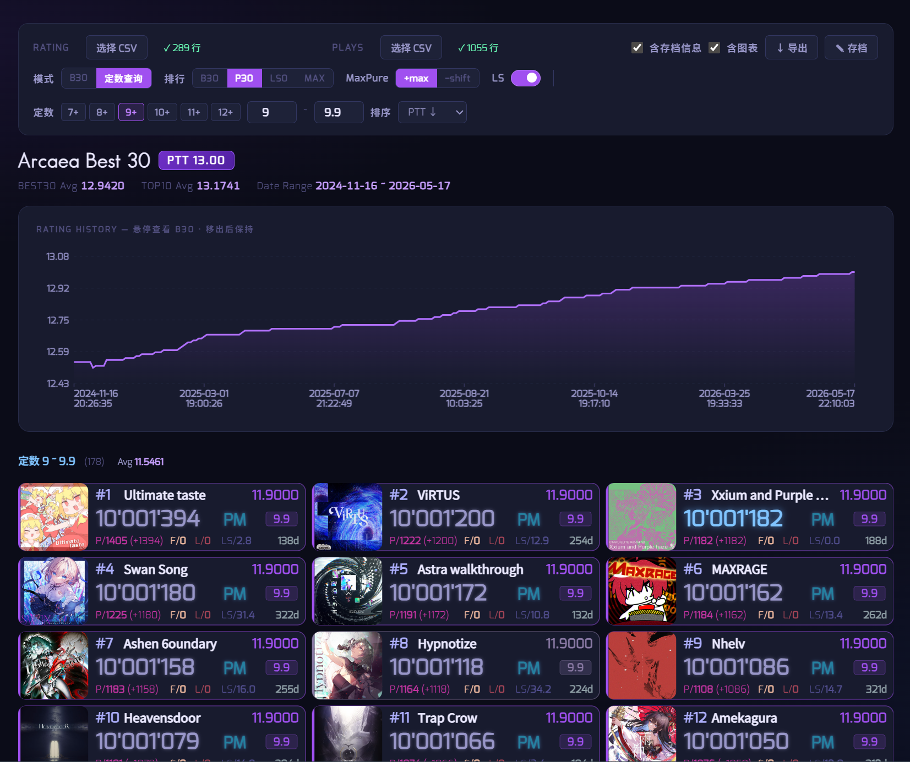

# Arcaea B30 Viewer

基于查分机器人导出数据的Arcaea B30 可视化工具，支持历史 PTT 折线图与多模式排行查看。并初步实现了视频导出功能。



## 功能

- **PTT 折线图**：展示历史潜力值变化，鼠标悬停在任意时间点可查看当时的 B30，移出后保持显示
- **多排行模式**：B30 / P30（Far=0 且 Lost=0）/ LS0·30（LS=0）/ MAX·30（Pure=MaxPure）
- **B30 & TOP10 Avg**：同时显示 Best30 平均值与 Top10 平均值
- **显示设置**：可切换 LS 显示、MaxPure 样式（`+maxPure` 或 `-(Pure-MaxPure)`）
- **存档信息**：手动填写用户名与潜力值，CSV 导入的最高 PTT 另行标注不覆盖
- **定数查询模式**: 给定特定定数范围，展示B30 / P30 等数据，并且可以展开所有数据，支持多种排序方式

## 目录结构

```
├── index.html
├── package.json          # 视频导出依赖（可选）
├── render/               # 视频导出脚本（可选）
│   ├── render.js
│   └── encode.js
├── data/                 # 视频导出用的数据文件
│   ├── ratings.csv
│   └── all_scores.csv
├── frames/               # 截图临时目录（自动创建）
└── src/
    ├── fonts/            # 本地字体文件（可选）
    └── songs/            # 曲目封面图片
        ├── songlist          # 曲目列表（JSON，无扩展名）
        └── {songId}/
            ├── 1080_base_256.jpg
            ├── 1080_3_256.jpg    # BYD 难度封面（可选）
            └── base_256.jpg      # fallback
```

## 数据文件格式

由Yurisaki Bot导出，共两个 CSV 文件。

**Rating History CSV(`ratings.csv`)**

```ratings.csv
Timestamp,DateTime,UserRating
1731759995024,2024/11/16 20:26,12.54
```

**Play History CSV(`all_scores.csv`)**

```all_scores.csv
SongId,Difficulty,Score,Constant,Potential,LS,MaxPure,Pure,Far,Lost,ClearType,Timestamp,DateTime
abstrusedilemma,2,9847862,11.3,12.53931,429.4,1237,1432,25,10,5,1719849794709,"2024-07-02 00:03:14"
```

| 字段 | 说明 |
|---|---|
| Difficulty | 0=PST 1=PRS 2=FTR 3=BYD 4=ETR |
| LS | Loss Score（越低越好，计算#用） |
| ClearType | 0=TL 1=NC 2=FR 3=PM 4=EC 5=HC |

## 导出步骤

1. 发送 `@Yurisaki /a export `
2. 得到回复 `@{username} [Arcaea Data Export] 数据已导出，地址：{address}`
3. 访问 `https://u.yurisaki.top/{address}`，下载`.zip`压缩文件
4. 解压后得到`ratings.csv`和`all_scores.csv`

## 使用

### 网页访问（推荐）

1. 访问 [Arcaea B30 Viewer](https://arctan01.github.io/arcaea-trend-b30/)
2. 上传 Rating CSV (`ratings.csv`) 和 Play CSV (`all_scores.csv`)

### GitHub Pages

1. Fork 本仓库
2. 将 `src/songlist`、`src/songs/` 放入对应目录
3. 开启 GitHub Pages，访问部署地址
4. 在页面上传 Rating CSV 和 Play CSV 即可

### 本地运行

`git clone https://github.com/Arctan01/arcaea-trend-b30.git` 到本地，直接双击 `index.html` 因浏览器 CORS 限制无法加载 songlist，需用本地 HTTP 服务器：

```bash
# 任选一种
npx serve .
python -m http.server 8080
```

然后访问 `http://localhost:8080`。

## 视频导出
 
使用 Puppeteer 驱动无头浏览器逐帧截图，再通过 ffmpeg 合成视频。截图和合成均在本地完成，不依赖 GitHub Pages。
 
### 环境准备
 
```bash
# 安装 Node.js 依赖
npm install
 
# 安装 ffmpeg（系统级）
# Windows
winget install ffmpeg
# macOS
brew install ffmpeg
```
 
### 配置
 
渲染前编辑 `render/config.json` 即可，无需修改脚本。
 
| 参数 | 默认值 | 说明 |
|---|---|---|
| `url` | `http://localhost:8080` | 本地服务器地址 |
| `profile` | `...` | 用户名和PTT值，若为空则不设置 |
| `display` | `b30 plus true` |分别设置模式('b30' \ 'p30' \ 'ls0' \ 'max') ，设置小P显示样式( 'plus' \ 'minus')，是否显示LS(true \ false) |
| `ratingCSV` | `./data/ratings.csv` | Rating History 文件路径 |
| `playCSV` | `./data/all_scores.csv` | Play History 文件路径 |
| `viewport` | `1200 × 1400` | 视频分辨率（同时控制截图区域） |
| `fps` | `30` | 帧率 |
| `framesPerPoint` | `45` | 每个时间点停留帧数（45帧 = 1.5秒） |
| `transitionFrames` | `15` | 淡入过渡帧数（15帧 = 0.5秒） |
| `pttStep` | `null` | 按 PTT 步长生成关键帧，`null` 则每个 rating 记录点一帧 |
 
### 运行
 
将两个 CSV 文件放入 `data/` 目录，然后：
 
```bash
# 终端1：启动本地服务器（保持运行）
npm run serve
 
# 终端2：一键截图并合成视频
npm run video
```
 
也可以分步运行：
 
```bash
npm run render   # 仅截图，输出到 frames/
npm run encode   # 仅合成，输出 b30-timelapse.mp4
```
 
### 输出
 
合成完成后生成 `b30-timelapse.mp4`。`frames/` 目录在下次运行时会自动清空重建。
 