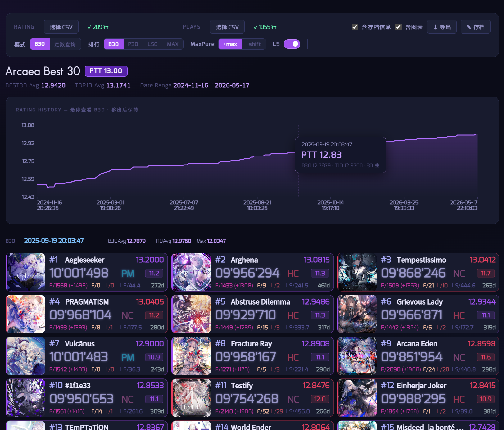
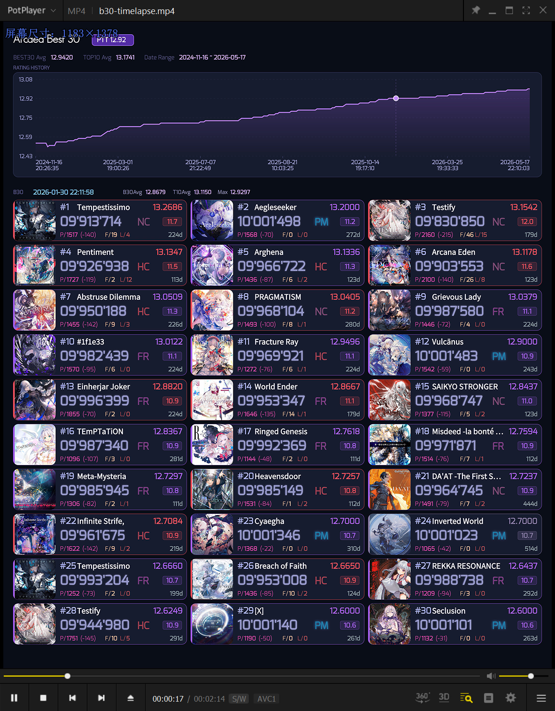

# Arcaea B30 Viewer

基于查分机器人导出数据的 Arcaea B30 可视化工具，支持历史 PTT 折线图与多模式排行查看，以及本地视频导出功能。



## 功能

- **PTT 折线图**：展示历史潜力值变化，鼠标悬停在任意时间点可查看当时的 B30，移出后保持显示
- **多排行模式**：B30 / P30（Far=0 且 Lost=0）/ LS0·30（LS=0）/ MAX·30（Pure=MaxPure）
- **B30 & TOP10 Avg**：同时显示 Best30 平均值与 Top10 平均值
- **显示设置**：可切换 LS 显示、MaxPure 样式（`+maxPure` 或 `-(Pure-MaxPure)`）
- **存档信息**：手动填写用户名与潜力值，CSV 导入的最高 PTT 另行标注不覆盖
- **定数查询模式**：给定特定定数范围，展示 B30 / P30 等数据，支持展开全部及多种排序方式
- **图片导出**：导出当前 B30 卡片为 PNG，可选择是否包含 PTT 折线图和存档信息
- **视频导出**：本地 Node.js 驱动，纯 Canvas 渲染，生成 PTT 成长历程视频

## 目录结构

```
├── index.html
├── package.json          # 视频导出依赖（可选）
├── render/               # 视频导出脚本（可选）
│   ├── config.json       # 渲染配置
│   ├── render.js         # 主渲染脚本（node-canvas）
│   ├── draw.js           # Canvas 绘制逻辑
│   ├── parse.js          # CSV 解析与 B30 计算
│   └── encode.js         # ffmpeg 合成脚本
├── data/                 # 视频导出用的数据文件（不提交到 git）
│   ├── ratings.csv
│   └── all_scores.csv
├── frames/               # 截图临时目录（自动创建，不提交到 git）
└── src/
    ├── Fonts/            # 本地字体文件
    └── songs/            # 曲目封面图片
        ├── songlist      # 曲目列表（JSON，无扩展名）
        └── {songId}/
            ├── 1080_base_256.jpg
            ├── 1080_3_256.jpg    # BYD 难度封面（可选）
            └── base_256.jpg      # fallback
```

## 数据文件格式

由Yurisaki Bot导出，共两个 CSV 文件。

**Rating History CSV(`ratings.csv`)**

```ratings.csv
Timestamp,DateTime,UserRating
1731759995024,2024/11/16 20:26,12.54
```

**Play History CSV(`all_scores.csv`)**

```all_scores.csv
SongId,Difficulty,Score,Constant,Potential,LS,MaxPure,Pure,Far,Lost,ClearType,Timestamp,DateTime
abstrusedilemma,2,9847862,11.3,12.53931,429.4,1237,1432,25,10,5,1719849794709,"2024-07-02 00:03:14"
```

| 字段 | 说明 |
|---|---|
| Difficulty | 0=PST 1=PRS 2=FTR 3=BYD 4=ETR |
| LS | Loss Score（计算#用） |
| ClearType | 0=TL 1=NC 2=FR 3=PM 4=EC 5=HC |

## 导出步骤

1. 发送 `@Yurisaki /a export `
2. 得到回复 `@{username} [Arcaea Data Export] 数据已导出，地址：{address}`
3. 访问 `https://u.yurisaki.top/{address}`，下载`.zip`压缩文件
4. 解压后得到`ratings.csv`和`all_scores.csv`

## 使用

### 在线访问（推荐）

1. 访问 [Arcaea B30 Viewer](https://arctan01.github.io/arcaea-trend-b30/)
2. 上传 Rating CSV (`ratings.csv`) 和 Play CSV (`all_scores.csv`)

### GitHub Pages

1. Fork 本仓库
2. 将 `src/songlist`、`src/songs/` 放入对应目录
3. 开启 GitHub Pages，访问部署地址
4. 在页面上传 Rating CSV 和 Play CSV 即可

### 本地运行

```bash
git clone https://github.com/Arctan01/arcaea-trend-b30.git
# 直接打开 index.html 因 CORS 限制无法加载 songlist，需用 HTTP 服务器：
npx serve .
# 或
python -m http.server 8080
```

访问 `http://localhost:8080`。

## 视频导出
 
旧方案使用 Puppeteer 驱动无头浏览器逐帧截图，再通过 ffmpeg 合成视频，截图和合成均在本地完成，不依赖 GitHub Pages。

重构之后使用 Node.js + node-canvas 在本地直接渲染每一帧，通过 ffmpeg 合成视频。不依赖浏览器，渲染速度远快于截图方案。



### 环境准备
 
```bash
# 安装 Node.js 依赖（含 node-canvas、fluent-ffmpeg）
npm install

# 安装 ffmpeg（系统级）
# Windows
winget install ffmpeg
# macOS
brew install ffmpeg
```
 
### 配置
 
### 配置

编辑 `render/config.json`，无需修改脚本。

| 参数 | 示例值 | 说明 |
|---|---|---|
| `ratingCSV` | `"../data/ratings.csv"` | Rating History 文件路径 |
| `playCSV` | `"../data/all_scores.csv"` | Play History 文件路径 |
| `outputDir` | `"./frames"` | 帧图输出目录 |
| `output` | `"./b30-timelapse.mp4"` | 视频输出路径 |
| `mode` | `"ptt"` / `"all"` / `"point"` | 关键帧生成模式（见下方说明） |
| `pttStart` | `12.90` | 起始 PTT（`ptt` / `point` 模式） |
| `pttEnd` | `13.00` | 结束 PTT（`ptt` / `point` 模式） |
| `pttStep` | `0.01` | PTT 步长（`ptt` 模式） |
| `fps` | `30` | 视频帧率 |
| `secPerPoint` | `1.5` | 每个关键帧停留时长（秒） |
| `transitionSecs` | `0.5` | 帧间 Crossfade 过渡时长（秒） |
| `includeChart` | `true` | 是否在画面中包含 PTT 折线图 |
| `includeHeader` | `true` | 是否在画面中包含存档信息和统计数据 |
| `profile.name` | `""` | 用户名，留空则不显示 |
| `profile.ptt` | `""` | 显示的 PTT 值，留空则不显示（已弃用） |
| `display.filter` | `"b30"` | 排行模式：`b30` / `p30` / `ls0` / `max` |
| `display.maxPureStyle` | `"plus"` | MaxPure 样式：`plus`（+maxPure）/ `minus`（−shift） |
| `display.showLS` | `true` | 是否显示 LS 字段 |
 
**关键帧生成模式说明：**

| 模式 | 说明 |
|---|---|
| `ptt` | 按 `pttStep` 步长在 `pttStart`～`pttEnd` 区间内生成等间距关键帧，PTT 数字匀速跳动，视觉效果最流畅 |
| `point` | 一对一渲染每个 rating 记录点，可用 `pttStart`/`pttEnd` 过滤范围 |
| `all` | 渲染全部 rating 记录点，不做过滤 |

### 运行
 
将两个 CSV 文件放入 `data/` 目录，然后：
 
```bash
# 终端1：启动本地服务器（保持运行）
npm run serve
 
# 终端2：一键截图并合成视频
npm run video
```
 
也可以分步运行：
 
```bash
npm run render   # 仅截图，输出到 frames/
npm run encode   # 仅合成，输出 b30-timelapse.mp4
```
 
### 输出
 
合成完成后生成 `b30-timelapse.mp4`。`render/frames/` 目录在下次运行时会自动清空重建。
 